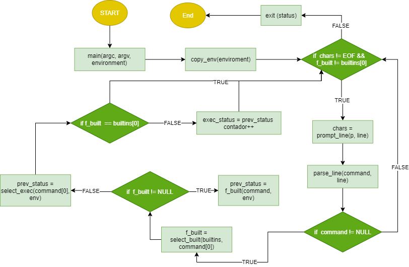

# Holberton Simple Shell

This is a simple simulation of command line interpreter for linux using only, `vi` and `emacs`, compiled with `gcc -Wall -Werror -Wextra -pedantic`, and debugged with `gdb` and `valgrind`.

## Flowchart



## Setup

Compile the program using `gcc -Wall -Werror -Wextra -pedantic *.c -o hsh` and run the interpreter mode with `./hsh`. In addition, use `echo "ls" | ./hsh` or `./hsh < scripts_file` or `cat scripts_file | ./hsh` to use non-interactive mode.

```shell
$ cat scripts_file
ls
pwd
ls -la
```
## Code Examples

To list the current directory:
```shell
$ ./hsh
#cisfun$ ls
lslist.c              memory.c                README.md    test        builtins_2.c  ...
#cisfun$ exit
```
Or use
```shell
$ echo "ls" | ./hsh
lslist.c              memory.c                README.md    test        builtins_2.c  ...
```
Or in general
```shell
$ ./hsh
#cisfun$ [COMMAND] [ARGUMENTS]
...
#cisfun$ exit
```
-----------------------------
```shell
$ echo "[COMMAND] [ARGUMENTS]" | ./hsh
...
```
-----------------------------
```shell
$ cat scripts_file
[COMMAND] [ARGUMENTS]
[COMMAND] [ARGUMENTS]
...
$ cat scripts_file | ./hsh
....
```

## Authors

This program was made by Alfredo Delgado Moreno ([@Alfred_Pianist](https://twitter.com/Alfred_Pianist)) and Joel Alexander Ramírez Núñez as a second major project for the first trimester of the foundations program of Holberton School.